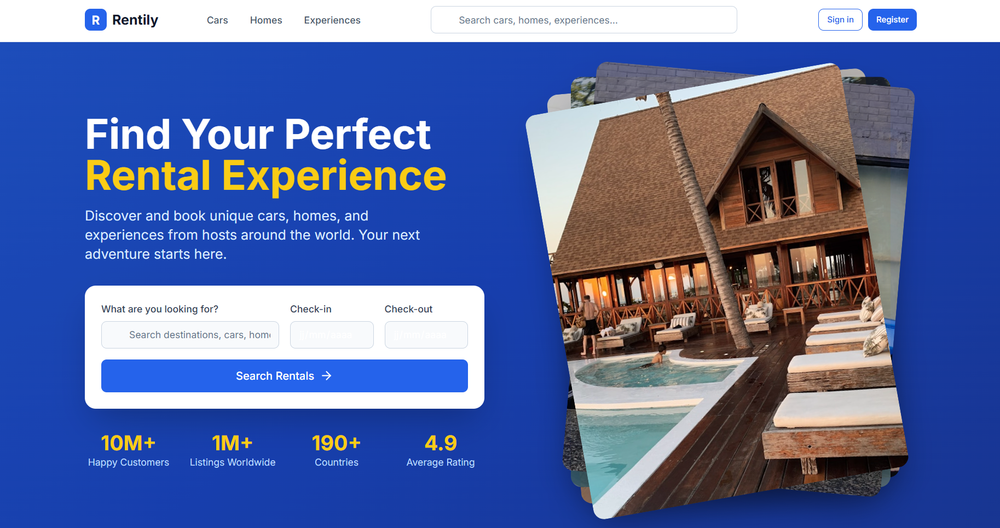
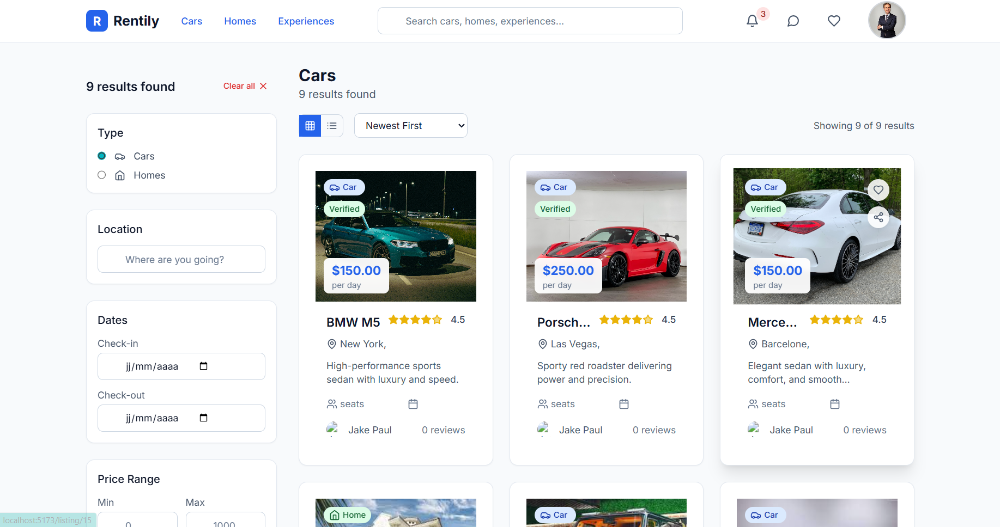
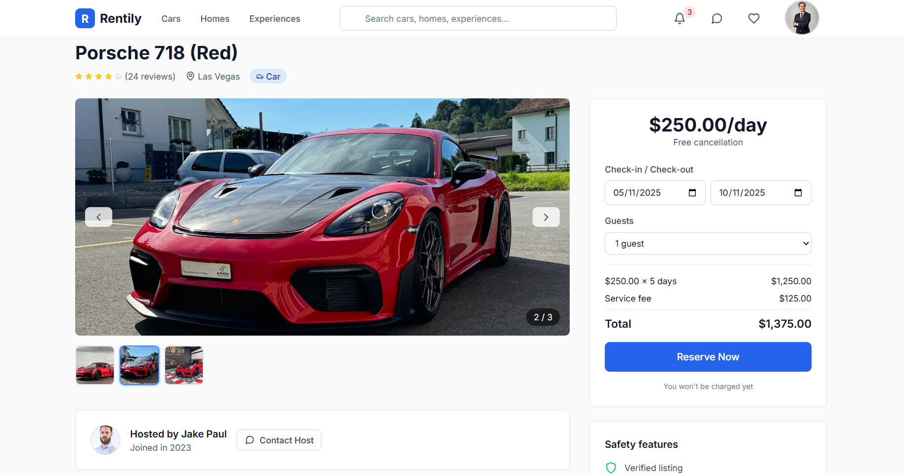
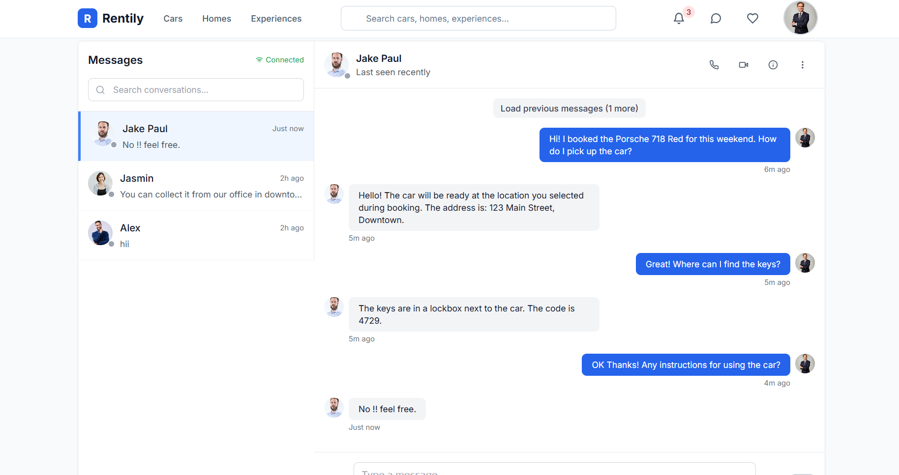
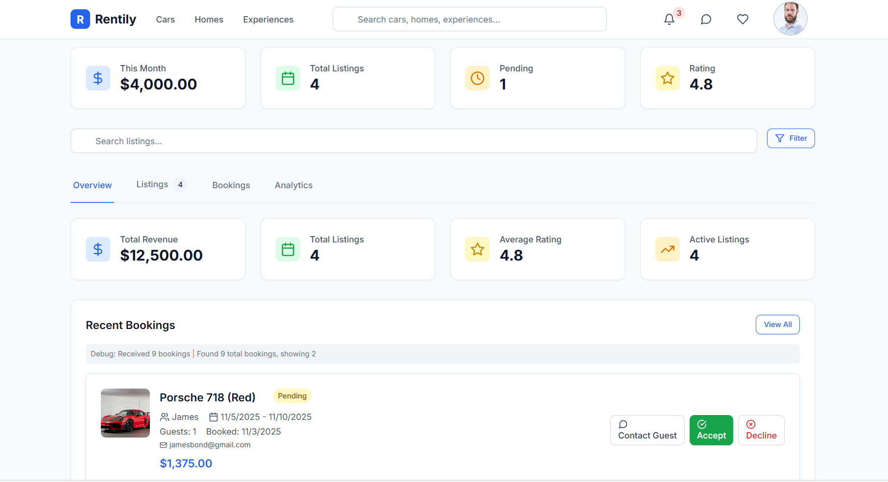

<h1 align="center">🏡 Rentily – Car & Home Rental Platform</h1>
<p align="center">
  A modern rental platform built with <b>Laravel</b> + <b>React</b> + <b>Tailwind CSS</b>.  
  Designed for guests to book cars, homes, and experiences, while hosts manage their listings and bookings.
</p>

---

## 🚀 About the Project

**Rentily** is a web-based platform that allows users to **browse and book cars, homes, and experiences**.  
Hosts can **list their vehicles and properties**, manage bookings, and communicate with guests in real-time.  
The system handles **secure payments, messaging, and booking confirmations**, ensuring smooth interactions between guests and hosts.

---

## 🧩 Key Features

### 🏘 Guest / Customer Features
- Browse and search for cars, homes, and experiences  
- View **availability** and **prices**  
- Make bookings directly through the platform  
- Save favorite listings for later  
- Real-time messaging with hosts  
- Secure payment processing  

### 👨‍💼 Host / Owner Features
- Add and manage **cars, homes, and experiences** listings  
- Manage bookings and confirm or decline requests  
- Receive **real-time notifications** for new bookings or messages  
- View analytics for your listings  

### 📊 General Features
- **Authentication & Roles:** Guest, Host, Admin  
- **User Profiles** with editable avatars  
- **Real-time messaging** between guests and hosts  
- Responsive UI for both desktop and mobile  
- Admin panel to manage users, listings, and system settings  

---

## 🖼️ Screenshots

### 🏠 Landing / Homepage


### 📋 Listings Page


### 🏷 Listing Detail & Booking


### 💬 Contacting the Owner


### 📊 Owner Dashboard


---

## ⚙️ Tech Stack
- 🧩 **Laravel 11** (Backend API)  
- ⚛️ **React + TypeScript** (Frontend)  
- 🎨 **Tailwind CSS** (Styling)  
- ⚡ **Alpine.js & Lucide Icons**  
- 🔔 **Laravel Echo + Pusher** (Real-time notifications)  
- 🗄️ **MySQL Database**  
- 📬 **SweetAlert2** (Alerts & notifications)  

---

## 🧑‍💻 Installation

```bash
git clone https://github.com/your-username/rentily.git
cd rentily

# Backend
composer install
cp .env.example .env
php artisan key:generate
php artisan migrate
php artisan db:seed
php artisan serve

# Frontend
cd frontend
npm install
npm run dev
